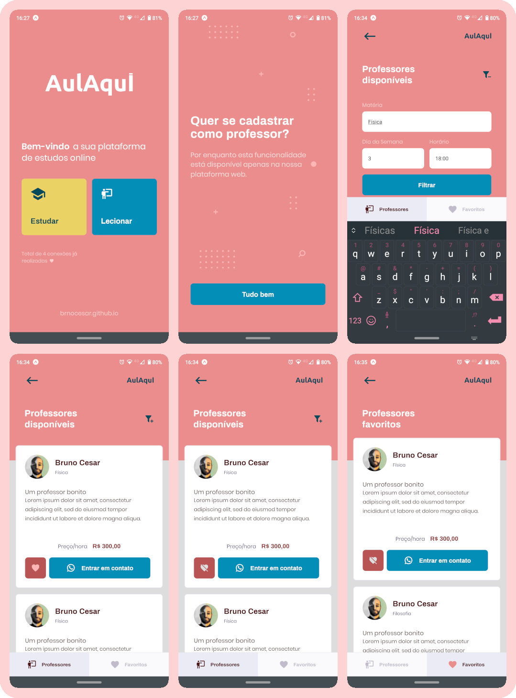

# aulaqui

As "semanas gratuitas" da [Rocketseat](https://rocketseat.com.br/) são eventos onlines que ocorrem cerca três ou quatro vezes ao ano e são realizados ao longo de uma semana. São compostos por aulas, _lives_ e espaços de discussões mediados, principalmente sobre carreiras de Tecnologia.

O destaque do evento é o "curso" focado na _stack_ JavaScript em que uma aplicação funcional é desenvolvida do zero. Nessa aplicação é utilizado o NodeJS para contruir o _back_, ReactJS para a versão _web_ e React Native para a _mobile_.

## :woman_teacher: :woman_student: Edição #13 (NLW 2) - Proffy
Nesta edição a aplicação é um marketplace para conectar professores e alunos.

### :gear: _back-end_

É uma API que atende as versões _web_ e _mobile_, os recursos disponíveis são:

| Verbo | Recurso | Ação | Query params |
|:-:|:-:|-|-|
| GET | `/aulas` | Retorna os professores/aulas cadastrados | `week_day`, `subject` e `time` (obrigatórios) |
| POST | `/aulas` | Persiste o registro de uma nova aula | - |
| GET | `/conexoes` | Retorna o número de conexões realizadas | - |
| POST | `/conexoes` | Persiste o registro de um novo Ponto de coleta | - |

:warning: Foi desenvolvida um **API em Lumen** com a mesma temática, mais recursos e seguindo o padrão RESTful. Acesse seu repositório [aqui](https://github.com/brnocesar/api-lumen-aulaqui).

### :desktop_computer: _Web_

> https://aulaqui.vercel.app/

A maior parte das funcionalidades está disponível na versão _web_:
- cadastrar aulas, com horário e matéria definida;
- acessar a lista de todos os Professores cadastrados e filtrá-los por matéria e valor
- acessar a lista de todos as Aulas cadastrados e filtrá-las por matéria e valor
- entrar em contato com um professor através do WhatsApp

### :iphone: _Mobile_
A versão _mobile_ permite buscar buscar professores filtrando-os, entrar em contato pelo WhatsApp e favoritá-los. Abaixo são apresentadas as telas da aplicação:

